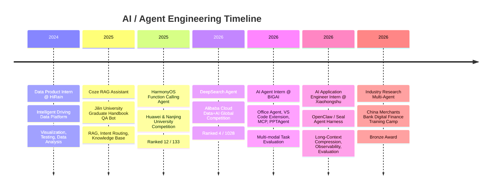

  
  
  
  
  

---

## 👨‍💻 About Me

Hi, I’m **Yuhang Xie**, a master’s student at **Jilin University**, focusing on **LLM Agents, RAG, Multi-Agent Systems, Context Engineering and AI Applications**.

I am currently working on **enterprise-level AI agents**, with hands-on experience in **Agent Harness optimization, long-context management, tool-use evaluation, observability, RAG systems and multi-agent workflows**.

I enjoy building AI systems that are not only powerful, but also **reliable, observable, controllable and useful in real-world scenarios**.

---

## 🧭 My Journey

---

## 🔥 Research & Engineering Interests

| Area | Keywords |
|---|---|
| 🧠 **LLM Agent Systems** | Planning, Tool Use, Execution Loop, Harness Engineering |
| 📚 **RAG & Deep Research** | Hybrid Retrieval, Evidence Grounding, Document Intelligence |
| 🧩 **Multi-Agent Systems** | Task Decomposition, Orchestration, Verification |
| 🪄 **Context Engineering** | Long-Context Compression, Memory, Token Efficiency |
| 📊 **Agent Evaluation** | Trace, Metrics, Latency, Tool-Use Quality |
| 🌊 **Computer Vision** | Image Dehazing, Maritime Visual Perception |

---

## 🚀 Featured Projects

### 🏦 Industry Research Multi-Agent  
**2026.06 · China Merchants Bank Digital Finance Training Camp**

A banking-oriented **Multi-Agent industry prosperity analysis system** for corporate account managers.

- Integrated **local RAG, web search, structured data analysis, scoring and report generation**
- Designed a centralized workflow for industry research, evidence collection and final judgment
- Built hybrid retrieval with **BM25 + Vector Search + RRF fusion**
- Completed a complex Multi-Agent prototype within **30 hours**
- 🏆 Won the **Bronze Award** in China Merchants Bank Digital Finance Training Camp

---

### 🔎 DeepSearch Agent  
**2026.01 – 2026.03 · Alibaba Cloud Data+AI Global Competition**

A ReAct-style web research agent for complex knowledge tasks.

- Built a multi-step search agent with **Think–Act–Observe** reasoning loop
- Designed prompt rules for evidence-driven reasoning, dynamic correction and answer verification
- Integrated search fallback, timeout control, retry strategy and robustness mechanisms
- 🏆 Ranked **4 / 1028**

---

### 📱 HarmonyOS Function Calling Agent  
**2025.10 – 2025.12 · Huawei & Nanjing University Competition**

A function-calling agent for HarmonyOS device control.

- Covered single-turn, multi-turn, single-intent and multi-intent tool invocation scenarios
- Used **Qwen3**, RAG and routing logic to improve tool selection and parameter generation
- Reduced single-instruction inference time from **2.13s to 0.85s**
- Achieved **98%** accuracy in single-turn smoke tests
- 🏆 Ranked **12 / 133**

---

### 🧠 Agent Context Management  
**2026 · Long-Horizon Agent Harness**

A long-horizon agent context optimization prototype inspired by production Agent Harness systems.

- Explored long-context compression and recoverable conversation-state management
- Designed context pruning strategies for multi-turn tool-use sessions
- Focused on **token efficiency, long-session stability and execution reliability**

---

### 📚 Local RAG Research Toolkit  
**2026 · Research Document Intelligence**

A lightweight local RAG toolkit for research documents.

- Supports parsing and indexing of **PDF / Excel / Markdown** documents
- Provides chunking, embedding, hybrid retrieval and evidence-grounded generation
- Designed for industry research, policy analysis and structured report generation

---

### 🌊 Overwater-Haze  
**2025 · First-Author SCI Paper**

A large-scale overwater paired image dehazing dataset and benchmark.

- Built a dataset with **21,000 synthetic hazy images** and **500 real-world test images**
- Evaluated multiple image dehazing algorithms for maritime visual perception
- Paper: [Overwater-Haze: A Large-Scale Overwater Paired Image Dehazing Dataset](https://www.mdpi.com/2227-9717/13/8/2628)

---

## 💼 Experience

### 🧩 Xiaohongshu · AI Application Product Engineer Intern  
**2026.04 – Present**

Working on **Seal**, an enterprise AI assistant based on OpenClaw.

- Designed and evaluated Agent Harness optimization mechanisms
- Built long-context compression for production-derived long sessions
- Achieved **31.51% average context pruning rate** and **92.77% success rate** on 332 long-context sessions
- Helped reduce end-to-end token consumption by **15%**
- Built observability for model latency, tool latency and user-perceived waiting time
- Improved user-perceived latency experience by **70%**

---

### 🤖 BIGAI · AI Agent Intern  
**2025.12 – 2026.03**

Worked on an AI-native office platform for task understanding, decomposition and execution.

- Developed VS Code extension for task management and Git commit message generation
- Built Cursor Prompt Agent based on MCP protocol
- Designed PPTAgent with slide editing tools, visual layout clustering and content schema extraction
- Built an evaluation pipeline with **120 multi-modal task samples**
- Analyzed model weaknesses in multi-party recognition, vague expression parsing and cross-turn state alignment

---

### 🚗 HiRain Technologies · Data Product Intern  
**2024.02 – 2024.06**

Worked on OrienLink, an intelligent driving data closed-loop platform.

- Designed prototypes for **20 visualization components**
- Wrote and executed test cases, submitted **53 defects**
- Built Python scripts for signal visualization and comparison
- Wrote a **10,000+ word** user manual

---

## 🏆 Highlights

| Achievement | Result |
|---|---|
| Alibaba Cloud Data+AI Global Competition | **4 / 1028** |
| Huawei & Nanjing University Agent Competition | **12 / 133** |
| China Merchants Bank Digital Finance Training Camp | **Bronze Award** |
| Overwater-Haze SCI Paper | **First Author** |
| Shanghai Outstanding Graduate | **Awarded** |
| Recommended Postgraduate Student | **Jilin University** |

---

## 🛠 Tech Stack

### Languages & Frameworks

### LLM / Agent / RAG

### Tools & Databases

---

## 📫 Contact

---

### Building AI agents that can think, act, observe and improve.

